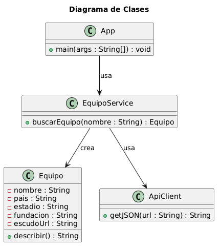

MiniFutbolInfo
MiniFutbolInfo es una aplicación sencilla en Java que permite buscar un equipo de fútbol y mostrar información básica como país, estadio, año de fundación y el escudo del club.

Funcionalidades
Buscar un equipo por nombre.

Mostrar datos básicos del equipo.

Mostrar la URL del escudo.

API utilizada
TheSportsDB — https://www.thesportsdb.com/api.php

## Diagrama de Clases

